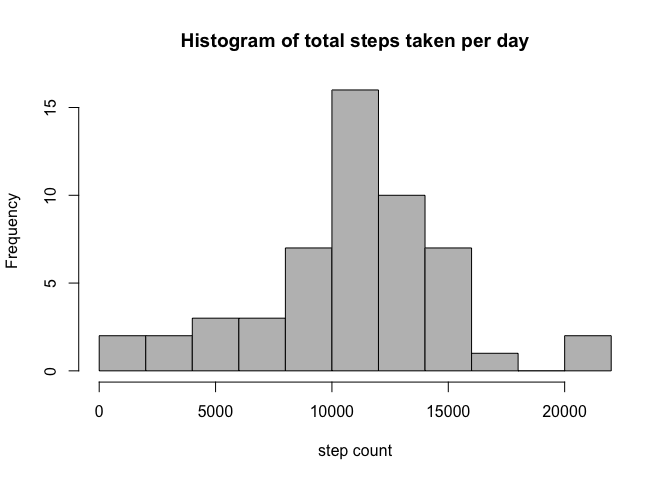
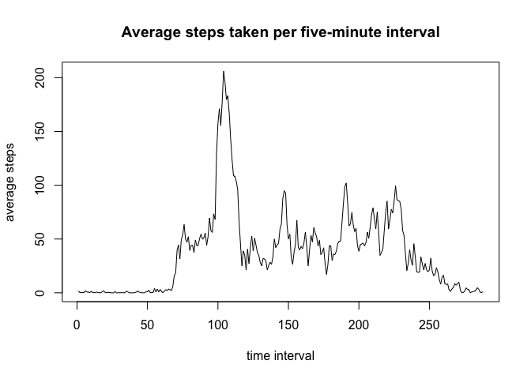
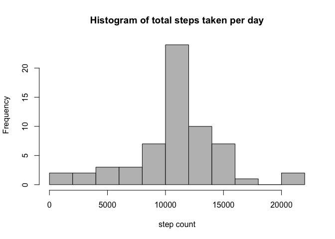
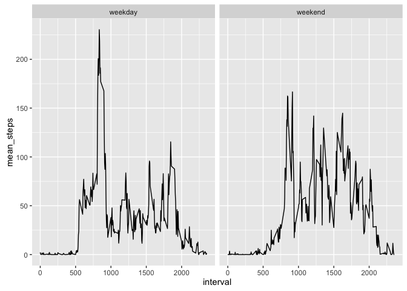

# Reproducible Research: Peer Assessment 1


## Loading and preprocessing the data

```r
library(dplyr)
```

```
## 
## Attaching package: 'dplyr'
## 
## The following objects are masked from 'package:stats':
## 
##     filter, lag
## 
## The following objects are masked from 'package:base':
## 
##     intersect, setdiff, setequal, union
```

```r
library(lubridate)

steps <- read.csv("activity.csv")
steps$date <- ymd(steps$date)
```
## What is mean total number of steps taken per day?

```r
total_steps_day <- group_by(steps, date) %>% summarise(daily_sum = sum(steps))

hist(total_steps_day$daily_sum, col="GRAY", breaks=10, main="Histogram of total steps taken per day", xlab="step count")
```

 

```r
mean(total_steps_day$daily_sum, na.rm=TRUE) # 10766.19
```

```
## [1] 10766.19
```

```r
median(total_steps_day$daily_sum, na.rm=TRUE) # 10765
```

```
## [1] 10765
```

## What is the average daily activity pattern?

```r
activity_pattern <- group_by(steps, interval) %>% summarise(mean_steps = mean(steps, na.rm=TRUE))

plot(activity_pattern$mean_steps, type='l', main="Average steps taken per five-minute interval", xlab="time interval", ylab="average steps")
```

 

```r
activity_pattern$interval[which.max(activity_pattern$mean_steps)] # 835, so 8:35am
```

```
## [1] 835
```

## Imputing missing values

```r
# I chose to use the mean for that 5-minute interval across all days.
# The average steps per 5-min interval is already stored in activity_pattern, so we just have to join those two datasets.
steps_imputed <- left_join(steps, activity_pattern)
```

```
## Joining by: "interval"
```

```r
steps_imputed$imputed <- steps_imputed$steps
steps_imputed$imputed[which(is.na(steps_imputed$imputed))] <- steps_imputed$mean_steps[which(is.na(steps_imputed$imputed))]

# clean up
steps_imputed$steps <- steps_imputed$imputed
steps_imputed <- select(steps_imputed, steps, date, interval)

# histogram
imputed_total_steps_day <- group_by(steps_imputed, date) %>% summarise(daily_sum = sum(steps))
hist(imputed_total_steps_day$daily_sum, col='GRAY', breaks=10, main="Histogram of total steps taken per day", xlab="step count")
```

 

```r
# mean and median of steps per day
mean(imputed_total_steps_day$daily_sum) # 10766.19
```

```
## [1] 10766.19
```

```r
median(imputed_total_steps_day$daily_sum) # 10766.19
```

```
## [1] 10766.19
```

The mean is the same as in the original, but the median differs.  This seems to be because there are whole days for which there's no data, and those days end up having the mean number of steps per day.  So, there are 8 days that have the same number of steps.  However, the mean and median were very close to begin with, so the difference is not actually very large.

## Are there differences in activity patterns between weekdays and weekends?

```r
steps_imputed$day <- weekdays(steps_imputed$date)
steps_imputed$weekday <- "weekday"

steps_imputed$weekday[which(steps_imputed$day %in% c("Saturday", "Sunday"))] <- "weekend"

ave_intervals <- group_by(steps_imputed, weekday, interval) %>% summarise(mean_steps = mean(steps))

library(ggplot2)
```

```
## Warning: package 'ggplot2' was built under R version 3.2.3
```

```r
par(mfrow=c(2,1))
ggplot(ave_intervals, aes(x=interval, y=mean_steps)) +
  geom_line() +
  facet_wrap(~weekday)
```

 

